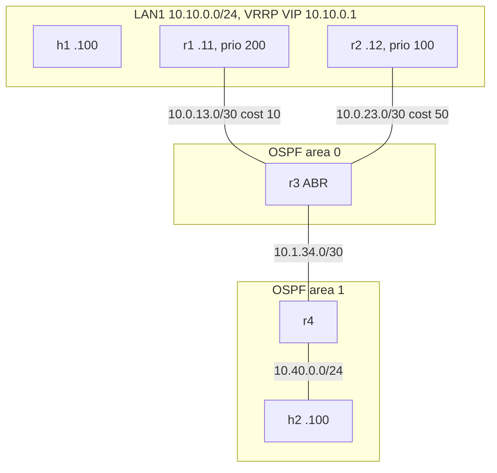

# Module 1: campus-core

Multi-area OSPF with a VRRP gateway pair. Four FRR routers, two areas, a host
LAN fronted by a virtual gateway address, and two scripted failure drills whose
results (including two genuinely surprising ones) are captured in
[artifacts/](artifacts/).

## Topology



h1's default gateway is the VRRP virtual IP 10.10.0.1 (virtual MAC
00:00:5e:00:01:0a). r1 is the preferred VRRP master and owns the preferred
cost 10 uplink; r2 is the backup on both counts. r3 is the area border router.

## Design decisions

- **Two areas with an ABR**: area 1 keeps its own link state database; r3
  summarizes LAN1 into it as an inter area route (visible as `O IA` on r4).
  This is the smallest topology that exercises real area behavior.
- **Asymmetric link costs (10 vs 50)**: gives the lab a deterministic best path
  and a meaningful reconvergence drill when that path dies.
- **VRRP on FRR**: FRR implements VRRPv3 over a Linux macvlan subinterface that
  carries the virtual MAC. The containerlab topology creates the macvlan at
  deploy time; FRR manages its state (protodown while Backup). This
  implementation detail turned out to shape the failover behavior measurably:
  see drill 1.
- **Point to point network type on router links**: skips DR election where it
  adds nothing. The LAN keeps the default broadcast type, so the r1/r2
  adjacency shows a real DR election (`Full/DR` in the artifacts).
- **Passive interface toward h2**: r4 advertises 10.40.0.0/24 without sending
  hellos at a host segment, standard practice for edge interfaces.

## Validation

`make campus-test` runs [tests/test_campus.py](tests/test_campus.py) against the
live lab: OSPF adjacency counts per router (Full state), VRRP master and backup
roles, the host's VIP default route, best path selection through the cost 10
link, the inter area route on r4, and end to end ping. 10 tests, all passing on
the committed run.

## Failure drills, with measured results

Both drills and a follow up probe are scripted in [drills/](drills/) and write
their evidence to [artifacts/](artifacts/).

**Drill 1, VRRP master failure**
([summary](artifacts/drill1-vrrp-failover/summary.md)): freezing r1's control
plane (docker pause) produced a takeover in 3.603s, within 6ms of the RFC 5798
computed master down interval, and zero packet loss because the frozen kernel
kept forwarding. Killing r1's LAN leg also produced zero loss: OSPF healed the
return path in 204ms, and a dedicated probe proved the backup forwards virtual
MAC frames while still in Backup state (bridge flooding plus the always
programmed macvlan). The classic 3 second blackout never appeared, and the
artifacts show exactly why.

**Drill 2, OSPF reconvergence**
([summary](artifacts/drill2-ospf-reconvergence/summary.md)): shutting the
preferred uplink triggered an immediate router LSA (reflooded by r2 within
440 microseconds), rerouting onto the cost 50 backup path in under 82ms with
zero loss. The capture shows each post failure request twice on the LAN, the
hairpin through the still master r1, and the routing table diff shows the cost
30 to 80 flip with the dead path marked inactive.

## Runbook

Run from the repo root inside WSL2 as root (containerlab needs it):

```
make campus-deploy         # generate configs, create br-campus, deploy
make campus-test           # 10 pytest assertions against the live lab
make campus-drill-vrrp     # drill 1: both VRRP failure scenarios
bash modules/01-campus-core/drills/probe_backup_forwarding.sh   # backup forwarding probe
make campus-drill-ospf     # drill 2: OSPF reconvergence
bash modules/01-campus-core/drills/collect_steady_state.sh      # refresh steady state artifacts
make campus-destroy
```

Useful inspection commands while the lab is up:

```
docker exec clab-bastion-campus-r1 vtysh -c 'show ip ospf neighbor'
docker exec clab-bastion-campus-r1 vtysh -c 'show vrrp'
docker exec clab-bastion-campus-r3 vtysh -c 'show ip ospf database'
docker exec clab-bastion-campus-r1 vtysh -c 'show ip route ospf'
docker exec clab-bastion-campus-h1 traceroute -n 10.40.0.100
ip netns exec clab-bastion-campus-h1 tcpdump -i eth1 -c 20 'vrrp or icmp'
```
