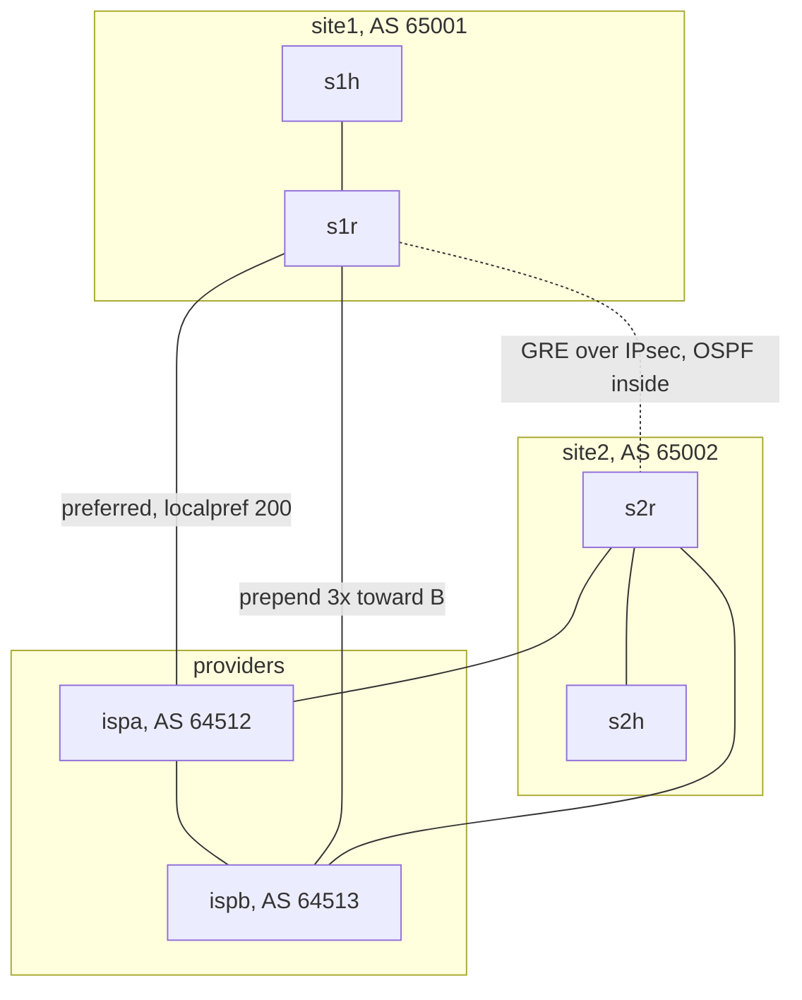

# Module 2: wan-edge

Two sites, two providers, real BGP policy, an encrypted overlay, and a
satellite experiment. Site1 steers traffic with local preference and AS path
prepending; the sites also run OSPF over GRE over IPsec so their private
subnets never touch the provider's routing table. Three drills measure what
actually happens when the preferred provider dies, when encryption disappears,
and when the WAN becomes a satellite hop.

## Topology



Addressing uses documentation and CGN space on purpose: public LANs
198.51.100.0/24 and 203.0.113.0/24, transit links from 100.64.0.0/10, site
loopbacks 192.0.2.1 and 192.0.2.2 (BGP announced, and the IKE plus GRE
endpoints), private overlay subnets 10.101.0.0/24 and 10.102.0.0/24 that exist
only inside the tunnel.

## What the policy does, verified live

- **Outbound**: routes learned from ispa get local preference 200
  (route map FROM-ISPA), so site1 sends via A. Artifact:
  [steady-state/s1r_bestpath_localpref.txt](artifacts/steady-state/s1r_bestpath_localpref.txt).
- **Inbound**: advertisements toward ispb carry three extra copies of 65001
  (route map TO-ISPB). Result, and the module's best lesson: ispb holds the
  prepended path but selects and propagates the 2 hop path through ispa
  instead, so the prepended path never reaches site2 at all. Prepending
  reroutes the topology around the link rather than merely demoting it.
  Artifact: [steady-state/ispb_three_paths_prepend.txt](artifacts/steady-state/ispb_three_paths_prepend.txt),
  which also catches site2 committing an accidental route leak
  (65002 64512 65001): see LEARN.md.
- **RFC 8212 compliance**: FRR rejects eBGP routes without explicit policy, so
  every session carries a generated route map (ALLOW-ALL where no shaping is
  intended).
- **Overlay isolation**: the private subnets appear in OSPF over the tunnel
  and nowhere else; `test_private_prefixes_not_in_bgp` proves the provider
  never learns them.

## Drills, with measured results

- **[BGP failover](artifacts/drill1-bgp-failover/summary.md)**: killing the
  preferred provider link cost exactly 1 packet of 197. Directly connected
  eBGP drops on link down, and the alternate path was already held in the BGP
  table, so failover is a local re rank, done before the next 200ms ping.
- **[Encryption on and off](artifacts/drill2-encryption-onoff/summary.md)**:
  captured inside the provider: 22 opaque ESP packets with IPsec up; 42
  readable GRE packets (inner IPs, ICMP, OSPF exposed) with it down; the 4
  packet IKEv2 negotiation bringing it back. Nothing broke when encryption
  vanished, which is precisely the operational danger.
- **[Satellite](artifacts/drill3-satellite/summary.md)**: 600ms RTT and 0.5%
  loss collapsed a single TCP flow from 5486 to 11 Mbps (500x); BBR plus 64MB
  buffer ceilings recovered it to 115 Mbps (10x).

## Runbook

From the repo root inside WSL2 as root:

```
make wan-deploy            # build the FRR+strongSwan image, generate, deploy
make wan-test              # 13 pytest assertions against the live lab
make wan-drill-bgp
make wan-drill-ipsec
make wan-drill-satellite
make wan-drift             # golden config vs running config
bash modules/02-wan-edge/drills/collect_steady_state.sh
make wan-destroy
```

Inspection while the lab runs:

```
docker exec clab-bastion-wan-s1r vtysh -c 'show ip bgp'
docker exec clab-bastion-wan-ispb vtysh -c 'show ip bgp 198.51.100.0/24'
docker exec clab-bastion-wan-s1r ipsec statusall
docker exec clab-bastion-wan-s1r vtysh -c 'show ip ospf neighbor'
docker exec clab-bastion-wan-s1h traceroute -n 10.102.0.100
ip netns exec clab-bastion-wan-ispa tcpdump -i eth1 -c 10 'esp or proto gre'
```
