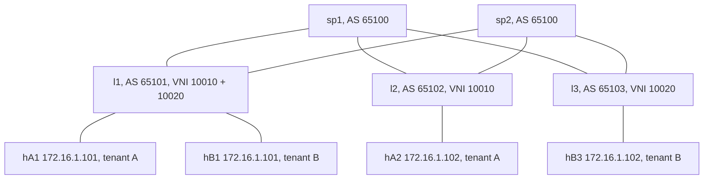

# Module 3: dc-fabric

An EVPN-VXLAN spine leaf fabric: 2 spines, 3 leaves, BGP unnumbered underlay
(no point to point IPv4 addressing anywhere), BGP EVPN as the overlay control
plane, and two tenants whose subnets overlap completely, including identical
host addresses, isolated by VNI and VRF with anycast gateways on every leaf.

This is how current data centers are actually built, and the artifacts here
show it working at both the control plane (type 2 and type 3 routes) and the
wire (VXLAN encapsulated frames captured mid fabric).

## Topology



Both tenants use 172.16.1.0/24 with gateway 172.16.1.1, and both tenants
contain a .101 and a .102 host. Nothing about the address plan
distinguishes them; only VNI 10010 vs 10020 does.

## Design decisions

- **eBGP unnumbered underlay**: sessions ride IPv6 link local addresses
  (`neighbor eth1 interface`), IPv4 routes carry IPv6 next hops (RFC 5549,
  visible in every `show ip route` artifact as fe80:: next hops). Adding a
  link means plugging it in: no addressing plan for the fabric itself.
- **Spines share one AS, each leaf gets its own**: standard eBGP fabric
  numbering; leaf to leaf paths are 65100 plus the remote leaf AS, and ECMP
  works because both spine paths present identical AS path length
  (maximum-paths 2, asserted by test).
- **EVPN as the only MAC learning mechanism**: the VXLAN devices are created
  with learning off. Every remote MAC in the kernel FDB was installed by FRR
  from a type 2 route: the test suite asserts hA2's MAC on l1 is type
  remote via VTEP 10.255.255.2.
- **Anycast gateways**: every leaf's tenant bridge carries the same IP and
  the same MAC per tenant, so a host's gateway is always one hop away and
  identical no matter which leaf it lands on: the prerequisite for workload
  mobility.
- **Overlapping tenants**: the strongest isolation demo available: identical
  subnets and identical host addresses, isolated by VNI on the wire and VRF
  in the leaf kernel. The suite proves 172.16.1.102 resolves to different
  physical NICs per tenant.
- **Aggressive hold timers (3/9)**: spine failure detection in single digit
  seconds; drill 2 shows the timer doing its job against a frozen spine.

## Drills, with measured results

- **[VXLAN proof](artifacts/drill1-vxlan-proof/summary.md)**: the same inner
  flow (172.16.1.101 to .102) captured leaving l1 as VNI 10010 toward VTEP
  10.255.255.2 and as VNI 10020 toward 10.255.255.3: multi tenancy visible
  in adjacent packets, with the two tenants ECMP hashed onto different
  uplinks as a bonus.
- **[Spine failure](artifacts/drill2-spine-failure/summary.md)**: freezing
  sp1 for 15s cost zero of 197 pings: ECMP halves the blast radius, the
  frozen kernel keeps forwarding, and the 9s hold timer degraded ECMP to a
  single next hop (and restored it on recovery), all captured in the route
  table artifacts.

## Runbook

From the repo root inside WSL2 as root:

```
make dc-deploy
make dc-test          # 18 assertions against the live fabric
make dc-drill-vxlan
make dc-drill-spine
make dc-drift
make dc-destroy
```

Inspection while the fabric runs:

```
docker exec clab-bastion-dc-l1 vtysh -c 'show bgp l2vpn evpn summary'
docker exec clab-bastion-dc-l1 vtysh -c 'show bgp l2vpn evpn route'
docker exec clab-bastion-dc-l1 vtysh -c 'show evpn vni'
docker exec clab-bastion-dc-l1 vtysh -c 'show evpn mac vni 10010'
docker exec clab-bastion-dc-l1 bridge fdb show br brA
docker exec clab-bastion-dc-l1 vtysh -c 'show ip route 10.255.255.2/32'
ip netns exec clab-bastion-dc-l1 tcpdump -i eth1 -c 6 'udp port 4789'
```
