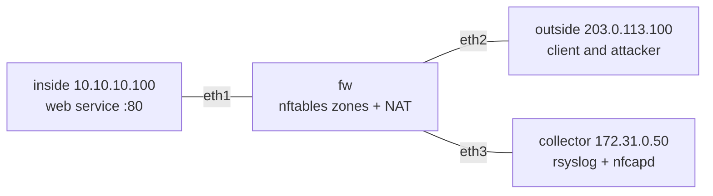

# Module 4: boundary-watch

A zone based nftables firewall routing between an inside segment, an untrusted
outside segment, and a management segment, with a full monitoring plane:
firewall denies shipped to a syslog collector, NetFlow exported and analyzed
into top talkers, and an annotated library of packet captures taken live from
this lab.

## Topology



## The policy (config/nftables.conf)

Zone based, default drop on the forward chain, stateful:

- inside to outside or management: allowed, and NAT rewrites the inside source
  to the firewall's outside address 203.0.113.1.
- outside to inside: allowed only to the published web service on
  10.10.10.100:80. Everything else is logged and dropped.
- management (collector) to inside: allowed; the reverse is not.
- invalid conntrack state: logged and dropped.

Every deny uses nft `log group 1`, which sends the packet to NFLOG (netlink).

## The monitoring plane

- **Firewall denies to syslog**: ulogd reads NFLOG group 1 and emits each
  denied packet to syslog; the firewall's rsyslog forwards to the collector,
  which files it under the sending host. This NFLOG path is used instead of
  kernel logging because container network namespaces do not surface nft
  kernel log messages through the shared ring buffer (WHAT-BROKE.md entry 7).
- **NetFlow**: softflowd on the firewall exports NetFlow v5 for traffic
  crossing the outside interface to the collector's nfcapd; nfdump analyzes
  the records into top talkers and top ports.
- **Captures**: [captures/](captures/) holds five annotated pcaps taken live,
  each with a walkthrough in [captures/README.md](captures/README.md).

## Drill and captures, with results

- **[Firewall drill](artifacts/drill1-firewall/summary.md)**: legitimate web
  traffic (200 x5) and inside browsing through NAT succeeded; an nmap scan and
  SYN flood from outside were dropped, producing 149 counted denies, 149
  syslog events at the collector with full packet detail, and a NetFlow top
  talkers table where the scanner stands out as many flows of few packets each.
- **Capture library**: TCP handshake vs a denied SYN (the SYN,ACK that never
  comes), source NAT proven by the same ping showing 10.10.10.100 on the
  inside interface and 203.0.113.1 on the outside, and the raw NetFlow v5
  export datagrams that feed nfdump.

## Runbook

From the repo root inside WSL2 as root:

```
make bw-deploy          # build the monitor image, deploy
make bw-test            # 7 policy assertions against the live firewall
make bw-drill           # generate traffic, collect syslog + NetFlow + counters
make bw-captures        # (re)build the annotated capture library
make bw-destroy
```

Inspection while the lab runs:

```
docker exec clab-bastion-boundary-fw nft list ruleset
docker exec clab-bastion-boundary-collector sh -c 'cat /var/log/lab/*.log'
docker exec clab-bastion-boundary-collector sh -c 'nfdump -R /var/cache/nfdump -s srcip/bytes -n 10'
docker exec clab-bastion-boundary-outside nmap -Pn -p 20-30,80 10.10.10.100
```
