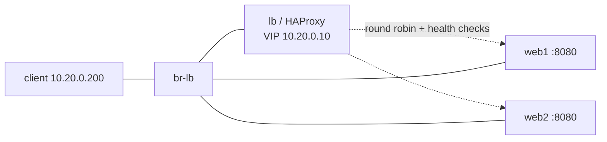

# Stretch module: load-balancer

HAProxy fronting two web backends on a virtual IP, with active health checks,
both an L7 (HTTP) and an L4 (TCP) front end, and a drill that kills a backend
mid stream to show health check driven failover. Covers the posting's load
balancing and Application Delivery Controller area (F5 BIG-IP and Citrix
NetScaler are the commercial equivalents of these same ideas).

## Topology



## What it demonstrates

- **Virtual IP**: clients hit 10.20.0.10; HAProxy owns the address and picks a
  backend per request.
- **L7 vs L4 front ends** (config/haproxy.cfg): port 80 is HTTP mode (HAProxy
  parses requests, can route on paths and headers, health checks with
  `GET /id`); port 8404 is TCP mode (connection level only, no HTTP
  awareness). Same backends, two levels of the stack.
- **Active health checks**: `inter 1s fall 2 rise 2` polls each backend every
  second, marks it down after 2 failures and up after 2 successes.
- **Round robin balancing**: the test asserts both backends serve, roughly
  evenly, over 20 requests.
- **Runtime stats**: a live stats page on :8405/stats.

## Drill result

[Backend failure](artifacts/drill1-backend-failure/summary.md): stopping web1
mid stream cost exactly 1 in flight request; within about 2 seconds the health
check removed web1 and all 21 requests during the outage went to web2, then
web1 rejoined on recovery.

## Runbook

```
make lb-deploy      # build the image, create br-lb, deploy
make lb-test        # 4 assertions against the live VIP
make lb-drill       # kill and restore a backend under continuous polling
make lb-destroy
```

Inspection:

```
docker exec clab-bastion-lb-client curl -s http://10.20.0.10/id      # which backend
docker exec clab-bastion-lb-client curl -s http://10.20.0.10:8405/stats
docker exec clab-bastion-lb-lb sh -c 'echo "show stat" | socat stdio /var/run/haproxy.sock'
```

## Interview notes

- *L4 vs L7 load balancing?* L4 distributes connections by IP and port with no
  visibility into content; L7 understands the application protocol and can
  route on URL, host header, or cookie, and can do TLS termination and session
  persistence. Both front ends here point at the same pool for contrast.
- *How fast does failover happen and what sets it?* The health check interval
  times the fall count: 2 seconds here. The one request already in flight to
  the dying backend fails; everything after shifts once the check trips.
- *Where do F5 and NetScaler fit?* Same concepts (VIP, pools, health checks,
  L4/L7, persistence, TLS offload) as dedicated appliances with more features
  and hardware acceleration. HAProxy and NGINX cover the ideas in software.
